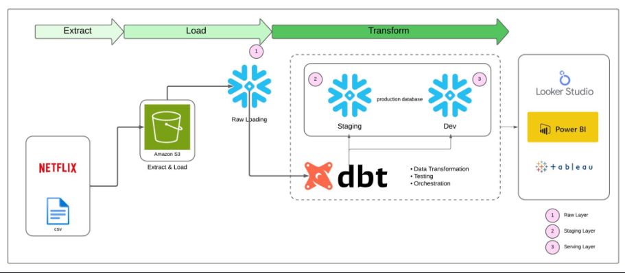

# 🎬 Real Time Movie Analytics ELT Pipeline using AWS, Snowflake & dbt

## 📌 Overview

This project demonstrates a modern **ELT (Extract, Load, Transform)** pipeline built for processing and modeling large-scale movie data using **Amazon S3**, **Snowflake Data Warehouse**, and **dbt (data build tool)**. The pipeline transforms raw CSV data into analytical data models optimized for reporting, exploration, and downstream consumption.

---

---

## 🚀 Tech Stack

- **Cloud Storage**: Amazon S3  
- **Data Warehouse**: Snowflake  
- **Transformation Tool**: dbt  
- **Dataset Source**: [MovieLens 20M Dataset](https://grouplens.org/datasets/movielens/20m/)

---

## 🗃️ Data Sources

The dataset originates from GroupLens and contains the following files:

| File Name            | Description                                                      |
|----------------------|------------------------------------------------------------------|
| `movies.csv`         | Metadata about movies (title, genres)                           |
| `ratings.csv`        | User-generated ratings                                           |
| `tags.csv`           | User-generated tags                                              |
| `links.csv`          | External identifiers (e.g., IMDB, TMDB)                         |
| `genome-scores.csv`  | Relevance scores for movie-tag pairs                             |
| `genome-tags.csv`    | Descriptions of genome tags                                      |

---

## 🔧 Architecture & Data Flow

### 1. **Extract & Load (EL)**

- **Raw Data Ingestion**:
  - Raw CSV files are uploaded to **Amazon S3**, serving as the data lake layer.
  
- **Loading into Snowflake**:
  - A **Snowflake external stage** is configured using IAM credentials to read from the S3 bucket.
  - Data is ingested into Snowflake's **RAW schema** using the `COPY INTO` command for high-performance parallel loading.

---

### 2. **Transform (T) with dbt**

The dbt project is structured into modular layers:

#### 🧱 Raw Layer

- Represents raw data ingested from S3.
- No transformations applied.
- Tables mirror the structure of the original CSVs for traceability and audit.

#### 🔄 Staging Layer (`stg_*`)

- dbt models act as **intermediate views** with:
  - **Data type standardization**
  - **Basic filtering**
  - **Field renaming and aliasing**
- Enhanced with **dbt tests**:
  - `not_null`, `unique`, and `accepted_values` constraints.
- Promotes **code modularity** and **layered transformations**.

#### 🧩 Dimensional & Fact Models

- Final transformed tables designed using **Kimball's star schema** principles:
  - **Dimension Tables**:
    - `dim_movies`
    - `dim_users`
    - `dim_tags`
  - **Fact Tables**:
    - `fact_ratings`
    - `fact_movie_tags`
- These models support performant analytical queries and dashboarding.

#### 🧠 dbt Macros

- Jinja-based macros are developed to encapsulate logic like:
  - Consistent date parsing
  - Null handling strategies
  - Type casting

#### ⏳ Slowly Changing Dimensions (SCD)

- **dbt Snapshots** track historical changes using Type 2 SCD methodology.
- Enables **time-travel analytics** for tracking attribute evolution over time.

---

## ✅ Data Quality & Testing

Extensive use of **dbt built-in testing** ensures data reliability:

- **Schema Tests**:
  - `unique`, `not_null`, `relationships`
- **Custom Tests**:
  - Implemented where standard tests aren't sufficient
---

## ⚙️ How to Run

### 1. Clone the Repository

```bash
git clone https://github.com/your-username/movie-elt-project.git
cd movie-elt-project
pip install dbt-snowflake
dbt run